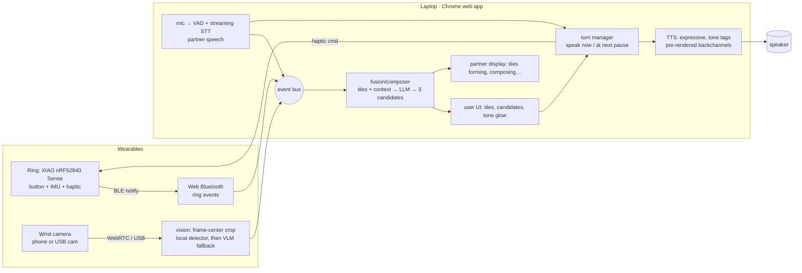

# 06 — Build plan: Mosaic

## Architecture (everything runs in a browser on one laptop where possible)


**Why browser-first:** Web Bluetooth (Chrome desktop) talks to an nRF52840 directly, which removes the Python BLE bridge. MediaPipe Tasks (`@mediapipe/tasks-vision`) does object, hand and gesture detection in-browser. `@ricky0123/vad-web` (Silero VAD, ONNX Runtime Web) gives `onSpeechEnd` for pause detection. TTS and LLM are HTTPS calls. One repo, one `npm run dev`.

## Module layout (also helps the LLM judge)
```
mosaic/
  firmware/ring/            # Arduino: ArduinoBLE service, button debounce, IMU gesture classifier, haptic
  web/src/ring/             # Web Bluetooth connect + event decode
  web/src/vision/           # camera, center-crop, detector, VLM fallback, top-3 labels
  web/src/listen/           # mic, VAD, STT, transcript buffer
  web/src/compose/          # tile state machine, prompt builder, JSON schema, candidate ranker
  web/src/turn/             # speak-now / speak-at-next-pause queue, floor-hold
  web/src/speech/           # TTS client, tone→tag mapping, pre-rendered backchannel cache
  web/src/ui/               # user view, partner view (2nd window), debug/latency overlay
  bench/latency.json        # produced by a script from real logs
  tests/                    # fusion + ranker + turn-manager unit tests
  README.md                 # problem, architecture, latency table, ethics, limitations
```

## Ring event protocol (BLE notify, 1 byte type + payload)
```yaml
service_uuid: "custom-128bit"   # choose one; document it in the README
events:
  CLICK: 0x01          # select (point target) / confirm candidate
  DOUBLE: 0x02         # 'more'
  LONG: 0x03           # speak-at-next-pause (queue)
  FLICK_UP: 0x10       # 'want'
  FLICK_DOWN: 0x11     # 'don't / no'
  FLICK_LEFT: 0x12     # undo last tile
  FLICK_RIGHT: 0x13    # 'help'
  CIRCLE: 0x14         # question mode
  SHAKE: 0x15          # clear all
  TWIST: 0x20          # payload int8 delta → scroll candidates
  TILT: 0x21           # payload int8 roll → tone dial (-2 sad … 0 neutral … +2 playful); pitch → urgency
  REACT_<n>: 0x30-0x37 # backchannels: mm-hmm, haha, yes, no, wait, wow, thanks, ugh
haptic_commands_from_host: {SELECTED: short, QUEUED: double, YOUR_TURN: long, ERROR: triple}
```
*Gesture set kept to ≤8 on purpose: AllyAAC found idiosyncratic gestures hard to recognize, so start with large, distinct motions and add per-user calibration (record 5 samples each).* Classifier options: (a) thresholds on gyro/accel peaks (fastest to ship, recommended first); (b) Edge Impulse model on-device (tutorial exists for this exact board).

## Composer contract (LLM I/O schema)
```json
{
  "input": {
    "tiles": [{"type":"intent","value":"want"},{"type":"object","value":"water","conf":0.82,"alts":["bottle","cup"]},{"type":"person","value":"Sam"}],
    "tone": "warm",
    "partner_last_utterances": ["Do you need anything before we start?"],
    "context": {"time":"14:05","place_hint":"kitchen"},
    "user_style_examples": ["gimme a sec", "nah I'm good", "that's hilarious"]
  },
  "output": {
    "candidates": [
      {"text":"Sam, could you grab me some water?","uses_tiles":[0,1,2],"tone_tag":"[warm]"},
      {"text":"I want water.","uses_tiles":[0,1],"tone_tag":"[neutral]"},
      {"text":"Water, please.","uses_tiles":[1],"tone_tag":"[warm]"}
    ]
  },
  "rules": ["candidate[1] must be the literal minimal sentence (preserve authorship)", "never add facts not in tiles/context", "match user_style_examples register", "<= 15 words each"]
}
```

## Hardware bill of materials (must source by Oct 3)
| Tier | Item | Approx. cost | Where / risk |
|---|---|---|---|
| **A (preferred)** | Seeed XIAO nRF52840 **Sense** (IMU + BLE + mic) ×2 (one spare) | ~$16 each | Seeed / Amazon / Digikey; **2-day shipping is a real risk** → order today. Micro Center stock unverified |
| A | 3.7 V LiPo 40–150 mAh with JST-PH; the XIAO has a charge circuit | ~$6 | Amazon/Adafruit |
| A | Tactile switch (6 mm) + coin vibration motor + NPN transistor/diode (or Adafruit DRV2605L haptic driver) | ~$5–8 | Adafruit/Amazon |
| A | Velcro finger strap / 3D-printed ring shell (Michigan makerspaces likely have printers; unverified) | ~$5 | — |
| A | Camera: phone on a forearm strap (browser getUserMedia via a local HTTPS page) **or** a small USB webcam on a wrist strap | $0–25 | Phone is the fastest path |
| **B (fallback)** | BLE "TikTok/Kindle remote ring" (HID keys/volume) | ~$10–15 | Amazon same/next-day; gives click and a few buttons, **no IMU** |
| **C (zero-hardware fallback)** | Phone strapped to the wrist as both camera **and** IMU (DeviceMotion API) + on-screen big button | $0 | Always works. Weak for the hardware track → choose Track 2 |
| Optional | Spectacles / AR glasses if loaners exist at the event | — | UNVERIFIED |

## Tech choices (pick quickly; all have browser or JS paths)
| Need | First choice | Fallback |
|---|---|---|
| Object at the point | MediaPipe Object Detector (EfficientDet-Lite, COCO 80 classes, in-browser) on the center crop | VLM call on the 384 px crop: "name the single object at the image center; JSON {label, alts[]}" |
| Pointing at a person | MediaPipe face detection at the center crop + enrolled name (demo: 2 teammates) | colored badge |
| Partner STT | Browser Web Speech API (free, streaming) | Whisper or realtime API |
| Pause detection | `@ricky0123/vad-web` `onSpeechEnd` + 500 ms hangover | energy threshold |
| LLM | fast tier model (Haiku/Flash-class), JSON mode, streaming | template grammar ("I want X", "Can you get X") so the demo never dies |
| TTS | **Cartesia Sonic 3** is the best fit for a physical tone dial: `generation_config` takes `emotion` (60+ values, e.g., neutral/excited/content/sad/angry), `speed` 0.6–1.5 and `volume` 0.5–2.0, over WebSocket; vendor-claimed 40–90 ms to first audio (Sonic Turbo ~40 ms). Map tilt-roll → emotion, tilt-pitch → speed (urgency), squeeze/long → volume. Alternatives: ElevenLabs Flash v2.5 (speed) / v3 audio tags `[laughs]`; OpenAI `gpt-4o-mini-tts` with an `instructions` field ("warm and reassuring"), cheap, latency unpublished | `speechSynthesis` (browser; has `rate`/`pitch`/`volume` for a crude tone dial) |
| Backchannels | Pre-render 8 clips at startup | — |

## 24h schedule (4 people: HW, Vision, Compose/Speech, UI/Demo; with 3, merge Vision with UI)
| Hours | HW (ring) | Vision | Compose + Speech + Turn | UI + Demo |
|---|---|---|---|---|
| 0–2 | Flash XIAO; BLE notify on button | Camera page, center crop | LLM schema plus template fallback; TTS hello-world | Repo, Vite app, layout of both views |
| 2–6 | Web Bluetooth connected; CLICK/DOUBLE/LONG | MediaPipe detector → top-3 label | Composer v1 (tiles → 3 candidates) | Tile bar, candidates, partner window |
| 6–10 | IMU flicks (thresholds); haptic motor | VLM fallback; person tile | STT + VAD; **speak-at-next-pause** queue | End-to-end loop with keyboard stand-ins |
| 10–14 | Twist/tilt → scroll/tone; enclosure v1 | Robustness: lighting, ROI | Tone→tags; pre-rendered backchannels | Latency overlay + logging to `bench/` |
| 14–18 | Battery and enclosure on a finger; spare ring | Tune the demo objects (water bottle, door, phone, a person) | Style examples; prompt hardening; tests | Polish visuals: tile animation, tone glow |
| 18–21 | Freeze firmware | Freeze | Freeze; README latency table from real logs | Demo rehearsal ×3, **record a backup video** |
| 21–24 | Judge-proofing | — | Devpost text (claims → code links) | Slides (3 max) + submission |

**Feature freeze at hour 18.** Anything that isn't working by then gets cut, in this order: lip reading → person pointing → twist scroll (use click cycling) → tone tilt (use preset buttons).

## Demo script (90 s, a judge can wear the ring)
*(Order changed after 09-critique.md: open with timing, not pointing, so it doesn't look like diaLEX/XAAC.)*
1. **(10 s) Hook:** "Nonspeaking people don't just talk slowly, they talk *late*: about 10–20 words a minute, so by the time the sentence is ready the conversation has moved on. This ring puts them back on time."
2. **(10 s) Instant:** the teammate tells a joke; the wearer flicks and a laugh plus "haha, nice" plays **immediately**.
3. **(25 s) Compose while they talk:** the teammate keeps talking ("so anyway, the presentation is at…"). The wearer points at a water bottle and clicks (`water` tile glows), flicks up (`want`), points at the teammate and clicks (`Sam`). Three candidates appear, shaped by what Sam just said; twist to choose; tilt to *warm*.
4. **(15 s) On cue:** long-press → *queued*. The partner display shows "✋ composing". At the teammate's pause the ring buzzes and the device says *"Sam, could you grab me some water?"* in a warm voice.
5. **(20 s) Judge tries it:** they wear the ring, point at something on their table and build a sentence.
6. **(10 s) Close:** "Each body signal does the part of language it's best at. The AI only does the glue, and the user always approves before anything is spoken."

## Judge Q&A prep
| Likely question | Answer |
|---|---|
| "Hasn't pointing-to-AAC been done?" | Yes (VocalEyes, SceneTalk). Pointing only covers nouns (fringe). Our contribution is fusing 4 channels with **timing-aware delivery** and **eyes-free backchannels**, which the research identifies as the unmet need |
| "Isn't the AI putting words in their mouth?" | Nothing is spoken without a click. The literal minimal sentence is always option 2. Style examples keep their voice. We cite "The less I type, the better" and the CHI '25 findings on the agency vs. timing tradeoff |
| "How is this different from COMPA / Lingraphica Conversations?" | Both are screen-based (Meet extension / tablet app). We're in-person, eyes-free and physical: world objects and gestures as input, the ring as the only control, output timed to the partner's pause, and tone control. We cite COMPA as the inspiration for partner notifications |
| "Who is this actually for?" | People who can move and vocalize but can't produce reliable speech: aphasia, nonspeaking autism, apraxia. Not late-stage ALS (gaze and BCI fit better) |
| "Privacy, with an always-on camera and mic?" | Camera frames only on click; partner audio processed for context and never stored; a local detector is the first choice |
| "Latency?" | Show the live overlay and `bench/latency.json` |
| "Did you test with users?" | Be honest: no. Name next steps (SLP feedback, a co-design session) and cite AllyAAC's 18-month participatory process as the model |

## Sources
[Web Bluetooth + Arduino Nano 33 BLE IMU example](https://github.com/ErniW/Web-bluetooth-and-Arduino-Nano-33-BLE) · [XIAO nRF52840 Sense + Web Bluetooth (DFRobot)](https://community.dfrobot.com/makelog-314584.html) · [Edge Impulse XIAO gestures](https://wiki.seeedstudio.com/XIAOEI/) · [MediaPipe Object Detector](https://developers.google.com/edge/mediapipe/solutions/vision/object_detector) · [MediaPipe Gesture Recognizer web](https://developers.google.com/edge/mediapipe/solutions/vision/gesture_recognizer/web_js) · [vad-web docs](https://docs.vad.ricky0123.com/user-guide/browser/) · [ricky0123/vad GitHub](https://github.com/ricky0123/vad) · [Cartesia Sonic 3 volume/speed/emotion](https://docs.cartesia.ai/build-with-cartesia/sonic-3/volume-speed-emotion) · [TTS 2026 comparison (fast.io)](https://www.fast.io/resources/best-ai-text-to-speech-tools-2026.md) · [gpt-4o-mini-tts](https://www.callmissed.com/en/models/gpt-4o-mini-tts) · [Shelly local HTTP API](https://developer.ekey.net/t/example-switching-a-shelly-plus-1/38) · [ElevenLabs v3](https://elevenlabs.io/blog/eleven-v3) · [Eleven v3 help](https://help.elevenlabs.io/hc/en-us/articles/35869054119057-What-is-Eleven-v3) · [XIAO nRF52840 Sense specs](https://thepihut.com/products/seeed-xiao-ble-nrf52840-sense)
